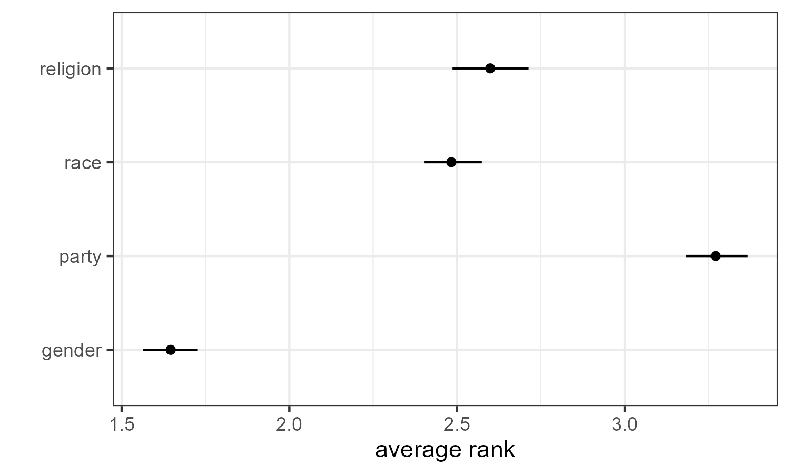

# `rankingQ`: Design-Based Methods for Improving Ranking Questions

`rankingQ` implements design-based methods for correcting measurement errors in ranking questions due to random responses. `rankingQ` allows users to estimate various ranking-based quantities of interest both non-parametrically and parametrically. `rankingQ` also offers practical tools for detecting the bias and assessing the anchor-ranking question.\
\
For the underlying methodology, see Atsusaka and Kim (2024) (<https://osf.io/preprints/osf/3ys8x>).

## Installation

`rankingQ` can be installed using the following code:

``` r
remotes::install_github(
  "sysilviakim/rankingQ",
  dependencies = TRUE
)
```

## Example

`rankingQ` assumes a dataset that contains (1) responses to ranking questions with `J` items and (2) a binary indicator for whether each respondent provides the correct answer to the anchor-ranking question---auxiliary ranking question whose correct answer(s) are known to researchers. For example, the package features a dataset `identity`, which stores responses to a question that asks respondents to rank four sources of identity (partisanship, race, gender, and religion) based on their relative importance.

``` r
library(rankingQ)
library(tidyverse)

data("identity")
head(identity)

#   app_party app_religion app_gender app_race
# 1         1            4          2        3
# 2         1            4          2        3
# 3         3            4          1        2
# 4         1            4          2        3
# 5         4            1          3        2
# 6         3            1          2        4
#   anc_house anc_neighborhood anc_city anc_state
# 1           1         2             3          4
# 2           1         2             3          4
# 3           1         2             3          4
# 4           1         2             3          4
# 5           1         3             2          4
# 6           1         2             3          4
#   anc_correct_identity  s_weight
# 1                    1 0.8439999
# 2                    1 0.8861603
# 3                    1 2.9644222
# 4                    1 0.9866697
# 5                    0 1.7573136
# 6                    1 0.4692241
```

### Target ranking question

Ranking data are expected to be in the wide format, where multiple columns are used to represent different items and their values represent the items' marginal ranks. In `identity`, the four sources of identity are app_party, app_religion, app_gender, and app_race. For example, the first respondent ranked party first, gender second, race third, and religion fourth (i.e., "1423" is the respondent's outcome).

### Anchor ranking question

To perform bias correction, the data must have what we call the anchor ranking question. The anchor question is an auxiliary ranking question that looks similar to the target question, whose "correct" answer is known to researchers. For example, `identity` has responses to the anchor question that asked respondents to rank order four levels of government: house, state, municipal, and school board. These responses are included in anc_house, anc_neighborhood, anc_city, and anc_state. Here, the correct answer is assumed to be "1234." Based on theses responses, we code an indicator variable (anc_correct_identity) that takes 1 if respondents offer the correct answer and 0 otherwise.

## Direct Bias Correction via `imprr_direct`

`rankingQ` has two primary functions to perform bias correction. First, `imprr_direct` **impr**oves **r**anking data by applying **direct** bias correction to several classes of quantities of interest.

To apply the bias correction, we specify our dataset (`data`), the number of items (`J`), the prefix of column names that contain `J` items for the target ranking questions, and the prefix of column names for the anchor ranking questions. When survey weights are available, they can be included by specifying `weight` in the function.

``` r

# Rename the items with a common prefix
identity <- identity %>%
  rename(app_identity_1 = app_party,
         app_identity_2 = app_religion,
         app_identity_3 = app_gender,
         app_identity_4 = app_race)


# Perform bias correction
out_direct <- imprr_direct(
  data = identity,
  J = 4,
  main_q = "app_identity",
  anc_correct = "anc_correct_identity"
)
```

### View Results: Estimated Proportion of Random Responses

The first output of `imprr_direct` is the estimated proportion of random responses. The vector `est_p_random` returns the estimated proportion along with the lower and upper ends of its corresponding 95% confidence interval.

``` r

# Estimated proportion of random responses with a 95% CI 
out_direct$est_p_random
#        mean     lower     upper
# 1 0.3153146 0.2864261 0.3481958
```

### View Results: Estimated Quantities of Interest

The other output is the bias-corrected estimates of four classes of ranking-based quantities, including

1.  average ranks
2.  pairwise ranking probabilities
3.  top-k ranking probabilities
4.  marginal ranking probabilities

The output tibble `qoi` stores the estimated quantities and their corresponding 95% CIs.

``` r

# View the results based on the quantity of interest
out_direct$qoi %>%
   filter(qoi == "average rank")
# A tibble: 4 × 6
# # Groups:   item, qoi [4]
#   item     qoi          outcome              mean lower upper
#   <chr>    <chr>        <chr>               <dbl> <dbl> <dbl>
# 1 party    average rank Avg: app_identity_1  3.27  3.18  3.37
# 2 religion average rank Avg: app_identity_2  2.60  2.49  2.71
# 3 gender   average rank Avg: app_identity_3  1.65  1.56  1.73
# 4 race     average rank Avg: app_identity_4  2.48  2.40  2.57

# View the results based on the item
out_direct$qoi %>%
   filter(item == "party")
   
# # A tibble: 11 × 6
# # Groups:   item, qoi [4]
#    item  qoi              outcome             mean  lower  upper
#    <chr> <chr>            <chr>              <dbl>  <dbl>  <dbl>
#  1 party average rank     Avg: app_identit… 3.27   3.18   3.37  
#  2 party marginal ranking Ranked 1          0.0409 0.0123 0.0729
#  3 party marginal ranking Ranked 2          0.152  0.121  0.181 
#  4 party marginal ranking Ranked 3          0.303  0.264  0.343 
#  5 party marginal ranking Ranked 4          0.505  0.460  0.552 
#  6 party pairwise ranking v. app_identity_2 0.355  0.306  0.399 
#  7 party pairwise ranking v. app_identity_3 0.106  0.0672 0.143 
#  8 party pairwise ranking v. app_identity_4 0.268  0.227  0.312 
#  9 party top-k ranking    Top-1             0.0409 0.0123 0.0729
# 10 party top-k ranking    Top-2             0.308  0.269  0.347 
# 11 party top-k ranking    Top-3             0.726  0.678  0.776 
```

For example, one can visualize the result for average ranks as follows:

``` r
# Plot the result
out_direct$qoi %>%
  filter(qoi == "average rank") %>%
  ggplot(aes(x = mean, y = item)) +
  geom_point() +
  geom_linerange(aes(xmin = lower, xmax = upper)) +
  theme_bw() +
  xlab("average rank") +
  ylab("")
```



## Weighting-Based Bias Correction via `imprr_weight`

The alternative methods for bias correction is based on the idea of inverse-prbability weighting. `imprr_weight` **impr**oves **r**anking data by computing bias correction **weights**, which can be used to correct for the bias in the inverse-probability weighting framework. The same arguments previously used can be used as follows:

``` r

# Perform bias correction
out_weights <- imprr_weights(
  data = identity,
  J = 4,
  main_q = "app_identity",
  anc_correct = "anc_correct_identity"
)
```

### View Results: Estimated Weights

The output of `imprr_weights` contains the set of weights for all possible ranking profiles with `J` items. For example, when `J = 4`, the set has `{1234, 1243, ..., 4321}` and each profile now has an estimated weight.

``` r

# View the estimated weights
out_weights$weights
#    ranking         w
# 1     1234 0.0000000
# 2     1243 0.0000000
# 3     1324 0.0000000
# 4     1342 0.0000000
# 5     1423 1.0158812
# 6     1432 0.4078355
# 7     2134 0.8582397
# 8     2143 0.8070574
# 9     2314 0.7456387
# 10    2341 0.0000000
# 11    2413 1.1316994
# 12    2431 0.5767371
# 13    3124 1.0238295
# 14    3142 0.5400194
# 15    3214 0.8251218
# 16    3241 0.0000000
# 17    3412 1.2733020
# 18    3421 1.0314721
# 19    4123 1.2628998
# 20    4132 1.1045545
# 21    4213 1.0388263
# 22    4231 0.4999637
# 23    4312 1.2711103
# 24    4321 1.0593130
```

### View Results: Estimated PMF with Raw Data and Bias Corrected Data

`imprr_weight` also returns the estimated probability mass function of all ranking profile before and after bias correction.

``` r

# View the estimated PMF with raw data and weighted data
> out_weights$corrected_pmf %>% 
select(ranking, prop, prop_renormalized)

#    ranking          prop prop_renormalized
# 1     1234 -0.0003526508       0.000000000
# 2     1243 -0.0044081345       0.000000000
# 3     1324 -0.0003526508       0.000000000
# 4     1342 -0.0098154461       0.000000000
# 5     1423  0.0483131539       0.046944603
# 6     1432  0.0077583167       0.007538549
# 7     2134  0.0293875632       0.028555111
# 8     2143  0.0253320795       0.024614506
# 9     2314  0.0212765957       0.020673901
# 10    2341 -0.0111672740       0.000000000
# 11    2413  0.0753497120       0.073215306
# 12    2431  0.0131656283       0.012792690
# 13    3124  0.0496649818       0.048258138
# 14    3142  0.0118138004       0.011479155
# 15    3214  0.0266839074       0.025928041
# 16    3241 -0.0030563066       0.000000000
# 17    3412  0.1659221817       0.161222159
# 18    3421  0.0510168097       0.049571673
# 19    4123  0.1537557306       0.149400343
# 20    4132  0.0672387446       0.065334095
# 21    4213  0.0523686376       0.050885208
# 22    4231  0.0104619725       0.010165620
# 23    4312  0.1632185259       0.158595089
# 24    4321  0.0564241213       0.054825814
```

### Merge Estimated Weights with Original Data

``` r

# Turn the results into a tibble
tibble_w <- out_weights$weights %>% tibble()


# Merge the weights back to the original data
identity_w <- identity %>%
  unite(ranking, starts_with("app_identity"), sep = "", remove = F) %>%
  left_join(tibble_w, by = "ranking") %>%
  select(w, everything()) %>%
  mutate(item = case_when(item == "app_identity_1" ~ "party",
                          item == "app_identity_2" ~ "religion",
                          item == "app_identity_3" ~ "gender",
                          item == "app_identity_4" ~ "race"))

# head(identity_w)
#       w ranking party religion gender  race anc_house anc_neighborhood
#   <dbl> <chr>   <dbl>    <dbl>  <dbl> <dbl>       <dbl>     <dbl>
# 1  1.02 1423        1        4      2     3           1         2
# 2  1.02 1423        1        4      2     3           1         2
# 3  1.27 3412        3        4      1     2           1         2
# 4  1.02 1423        1        4      2     3           1         2
# 5  1.10 4132        4        1      3     2           1         3
# 6  1.02 3124        3        1      2     4           1         2
```

### Analysis

The estimated weights can be used to perform any analyses. For example, to estimate the average rank of party, one can leverage linear regression as follows:

``` r
library(estimatr)
lm_robust(party ~ 1, identity_w, weights = w) %>% tidy()

#          term estimate  std.error statistic p.value conf.low
# 1 (Intercept) 3.220388 0.02790142  115.4202       0 3.165641
#   conf.high   df outcome
# 1  3.275135 1081   party
```

While this illustrative example provides a valid point estimate, its confidence interval does not account for the estimation uncertainty around the estimated weights. Thus, in practice, `imprr_weights` must be used along with bootstrapping, such as the one available in `rsample` ([example](https://declaredesign.org/r/estimatr/articles/estimatr-in-the-tidyverse.html#bootstrap-using-rsample)).

## References

Atsusaka, Y., & Kim, S.S. (2024). Addressing Measurement Errors in Ranking Questions for the Social Sciences. *Political Analysis* (conditionally accepted). <https://osf.io/preprints/osf/3ys8x>
