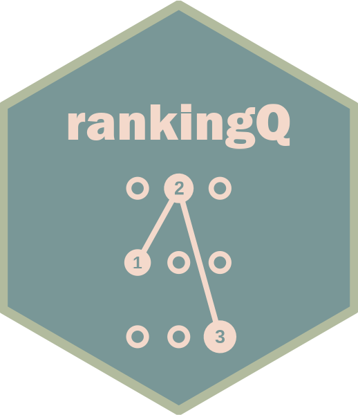

# `rankingQ`: Design-Based Methods for Improving Ranking Questions


[](https://doi.org/10.1017/pan.2024.33)

## Overview

Survey ranking questions are prone to random responses, where respondents answer carelessly or arbitrarily. `rankingQ` corrects this measurement error using anchor-ranking items, enabling unbiased estimates of ranking-based quantities such as average ranks, marginal rank probabilities, and pairwise preferences.

`rankingQ` implements design-based methods for correcting measurement error in survey ranking questions caused by random responding. It provides direct bias correction, inverse-probability weighting (IPW), visualization helpers, and diagnostics for assessing anchor-ranking questions.

For the underlying methodology, see [Atsusaka and Kim (2025)](https://doi.org/10.1017/pan.2024.33), "Addressing Measurement Errors in Ranking Questions for the Social Sciences," *Political Analysis*, 33(4), 339-360. Visit the [package site](https://sysilviakim.com/rankingQ/) for vignettes and references.

## Installation

Currently, you can install the development version from GitHub:

``` r
remotes::install_github("sysilviakim/rankingQ", dependencies = TRUE)
```

## Key Features

- **Bias correction via plug-in estimator** (`imprr_direct`): estimates average ranks, marginal rank probabilities, pairwise preferences, and top-k rankings with confidence intervals
- **Bias correction via IPW** (`imprr_weights`): reweights observed ranking distributions to correct for random responses
- **Visualization** (`plot_avg_ranking`): plots corrected average rankings with uncertainty bounds
- **Diagnostics**: tools for detecting bias and assessing anchor-ranking questions

## Example

The following is a simplified example of how the package can be used. For a fuller demonstration, visit [sysilviakim.com/rankingQ](https://sysilviakim.com/rankingQ/).

``` r
library(rankingQ)

data("identity")

head(identity)

# Perform bias correction via the plug-in estimator
out_direct <- imprr_direct(
  data = identity,
  J = 4,
  main_q = "app_identity",
  anc_correct = "anc_correct_identity",
  weight = "s_weight"
)

# Perform bias correction via inverse-probability weighting (IPW)
out_weights <- imprr_weights(
  data = identity,
  J = 4,
  main_q = "app_identity",
  anc_correct = "anc_correct_identity"
)
```

<details>
<summary>View <code>head(identity)</code> output</summary>

``` r
head(identity)
# A tibble: 6 x 16
#   s_weight app_identity app_identity_1 app_identity_2 app_identity_3
#      <dbl> <chr>                 <dbl>          <dbl>          <dbl>
# 1    0.844 1423                      1              4              2
# 2    0.886 1423                      1              4              2
# 3    2.96  3412                      3              4              1
# 4    0.987 1423                      1              4              2
# 5    1.76  4132                      4              1              3
# 6    0.469 3124                      3              1              2
# ... with 11 more variables: app_identity_4 <dbl>, anc_identity <chr>,
#   anc_identity_1 <dbl>, anc_identity_2 <dbl>, anc_identity_3 <dbl>,
#   anc_identity_4 <dbl>, anc_correct_identity <dbl>,
#   app_identity_recorded <chr>, anc_identity_recorded <chr>,
#   app_identity_row_rnd <chr>, anc_identity_row_rnd <chr>
```

</details>

<details>
<summary>View <code>head(out_direct$results, 10)</code> output</summary>

``` r
head(out_direct$results, 10)
# A tibble: 10 x 6
# Groups:   item, qoi [4]
#    item           qoi              outcome               mean   lower  upper
#    <chr>          <chr>            <chr>                <dbl>   <dbl>  <dbl>
#  1 app_identity_1 average rank     Avg: app_identity_1 3.27   3.13    3.40
#  2 app_identity_1 marginal ranking Ranked 1            0.0512 0.00568 0.0958
#  3 app_identity_1 marginal ranking Ranked 2            0.132  0.0863  0.178
#  4 app_identity_1 marginal ranking Ranked 3            0.310  0.263   0.371
#  5 app_identity_1 marginal ranking Ranked 4            0.507  0.452   0.573
#  6 app_identity_1 pairwise ranking v. app_identity_2   0.361  0.302   0.420
#  7 app_identity_1 pairwise ranking v. app_identity_3   0.107  0.0428  0.165
#  8 app_identity_1 pairwise ranking v. app_identity_4   0.260  0.196   0.315
#  9 app_identity_1 top-k ranking    Top-1               0.0512 0.00568 0.0958
# 10 app_identity_1 top-k ranking    Top-2               0.183  0.115   0.243
```

</details>

<details>
<summary>View <code>head(out_weights$rankings)</code> output</summary>

``` r
head(out_weights$rankings)
#   ranking  n    prop_obs     prop_bc   weights   prop_bc_raw prop_bc_adj
# 1    1234 14 0.012939002 0.000000000 0.0000000 -0.0003526508 0.000000000
# 2    1243 11 0.010166359 0.000000000 0.0000000 -0.0044081345 0.000000000
# 3    1324 14 0.012939002 0.000000000 0.0000000 -0.0003526508 0.000000000
# 4    1342  7 0.006469501 0.000000000 0.0000000 -0.0098154461 0.000000000
# 5    1423 50 0.046210721 0.046944603 1.0158812  0.0483131539 0.048313154
# 6    1432 20 0.018484288 0.007538549 0.4078355  0.0077583167 0.007758317
```

</details>

The `out_weights$results` data frame includes a `weights` column that can be reused in downstream analyses such as `avg_rank(..., raw = FALSE, weight = "weights")`.

## Citation

If you use `rankingQ`, please cite:

> Atsusaka, Yuki, and Seo-young Silvia Kim. 2025. "Addressing Measurement Errors in Ranking Questions for the Social Sciences." *Political Analysis* 33(4): 339-360. <https://doi.org/10.1017/pan.2024.33>

``` bibtex
@article{atsusaka2025,
  author  = {Atsusaka, Yuki and Kim, Seo-young Silvia},
  title   = {Addressing Measurement Errors in Ranking Questions for the Social Sciences},
  journal = {Political Analysis},
  volume  = {33},
  number  = {4},
  pages   = {339--360},
  year    = {2025},
  doi     = {10.1017/pan.2024.33}
}
```
