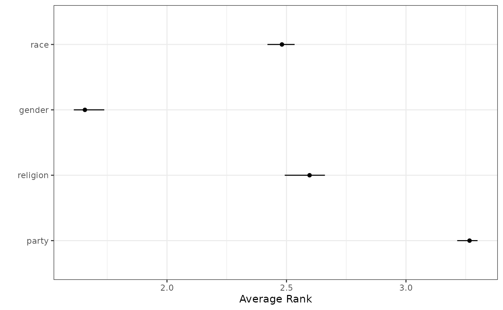

# 2. Correcting Bias in Ranking Data

``` r
library(rankingQ)
data(identity)

library(dplyr)
library(ggplot2)
library(tidyr)
```

## Estimating the Proportion of Random Responses

In the `identity` dataset, given `anc_correct_identity`, the raw
proportion of those who have correctly or incorrectly answered the
anchor question is as follows:

``` r
round(prop.table(table(identity$anc_correct_identity)) * 100, digits = 1)
```

    ## 
    ##    0    1 
    ## 30.3 69.7

The 69.7% seen here, however, is likely an upwardly biased estimate of
the percentage of non-random responses, because we must account for
respondents accidentally answering the question correctly. For an
unbiased estimation of random responses, we use `unbiased_correct_prop`.

``` r
identity$random_identity <- case_when(
  identity$anc_correct_identity == 1 ~ 0,
  TRUE ~ 1
)

unbiased_correct_prop(
  sum(identity$random_identity == 0) / sum(!is.na(identity$random_identity)),
  J = 4
)
```

    ## [1] 0.6836776

The revised estimate of non-random responses is 68.4%. That is to say,
roughly 31.6% of the respondents are randomly responding.

## Direct Bias Correction via `imprr_direct`

`rankingQ` has two primary functions to perform bias correction. First,
`imprr_direct` **impr**oves **r**anking data by applying **direct** bias
correction to several classes of quantities of interest.

To apply the bias correction, we specify our dataset (`data`), the
number of items (`J`), the prefix of column names that contain `J` items
for the target ranking questions, and the prefix of column names for the
anchor ranking questions. When survey weights are available, they can be
included by specifying `weight` in the function.

``` r
## app_identity_1 indicates marginal rank for party
## app_identity_2 indicates marginal rank for religion
## app_identity_3 indicates marginal rank for gender
## app_identity_4 indicates marginal rank for race

# Perform bias correction
out_direct <- imprr_direct(
  data = identity,
  ## Not strictly necessary if app_identity, the input for `main_q`,
  ## is specified. In that case, will look for J if unspecified
  J = 4,
  ## automatically looks for
  ## app_identity_1, app_identity_2, app_identity_3, app_identity_4
  main_q = "app_identity",
  anc_correct = "anc_correct_identity",
  # setting to 10 only for our vignette
  n_bootstrap = 10
)
```

    ## No weight column supplied; using equal weights for all observations.

By default, `imprr_direct` assumes that the target population is a set
of non-random respondents. When researchers wish to study the entire
population as a target group, additional arguments must be specified,
including `population` and `assumption`. For example, the uniform
preference assumption can be specified as follows:

``` r
# Bias correction for the entire population with the uniform assumption

out_direct_uniform <- imprr_direct(
  data = identity,
  J = 4,
  main_q = "app_identity",
  anc_correct = "anc_correct_identity",
  population = "all",
  assumption = "uniform",
  n_bootstrap = 10
)
```

    ## No weight column supplied; using equal weights for all observations.

Similarly, the contaminated sampling assumption can be specified as
follows:

``` r
# Bias correction for the entire population with contaminated sampling

out_direct_contaminated <- imprr_direct(
  data = identity,
  J = 4,
  main_q = "app_identity",
  anc_correct = "anc_correct_identity",
  population = "all",
  assumption = "contaminated",
  n_bootstrap = 10
)
```

    ## No weight column supplied; using equal weights for all observations.

### Results: Estimated Proportion of Random Responses

The first output of `imprr_direct` is the estimated proportion of random
responses. The vector `est_p_random` returns the estimated proportion
along with the lower and upper ends of its corresponding 95% confidence
interval.

``` r
# Estimated proportion of random responses with a 95% CI
out_direct$est_p_random
```

    ##        mean     lower     upper
    ## 1 0.3158402 0.2875352 0.3451338

### Results: Estimated Quantities of Interest

The other output is the bias-corrected estimates of four classes of
ranking-based quantities, including

1.  average ranks
2.  pairwise ranking probabilities
3.  top-k ranking probabilities
4.  marginal ranking probabilities

The output tibble `qoi` stores the estimated quantities and their
corresponding 95% CIs.

``` r
# View the results based on the quantity of interest
out_direct$results %>%
  filter(qoi == "average rank")
```

    ## # A tibble: 4 × 6
    ##   item           qoi          outcome              mean lower upper
    ##   <chr>          <chr>        <chr>               <dbl> <dbl> <dbl>
    ## 1 app_identity_1 average rank Avg: app_identity_1  3.27  3.21  3.30
    ## 2 app_identity_2 average rank Avg: app_identity_2  2.60  2.49  2.66
    ## 3 app_identity_3 average rank Avg: app_identity_3  1.66  1.61  1.74
    ## 4 app_identity_4 average rank Avg: app_identity_4  2.48  2.42  2.53

``` r
# View the results based on the item
out_direct$results %>%
  filter(item == "app_identity_1")
```

    ## # A tibble: 11 × 6
    ##    item           qoi              outcome               mean  lower  upper
    ##    <chr>          <chr>            <chr>                <dbl>  <dbl>  <dbl>
    ##  1 app_identity_1 average rank     Avg: app_identity_1 3.27   3.21   3.30  
    ##  2 app_identity_1 marginal ranking Ranked 1            0.0427 0.0309 0.0638
    ##  3 app_identity_1 marginal ranking Ranked 2            0.151  0.133  0.171 
    ##  4 app_identity_1 marginal ranking Ranked 3            0.304  0.289  0.336 
    ##  5 app_identity_1 marginal ranking Ranked 4            0.503  0.488  0.520 
    ##  6 app_identity_1 pairwise ranking v. app_identity_2   0.359  0.335  0.382 
    ##  7 app_identity_1 pairwise ranking v. app_identity_3   0.109  0.0807 0.143 
    ##  8 app_identity_1 pairwise ranking v. app_identity_4   0.266  0.257  0.287 
    ##  9 app_identity_1 top-k ranking    Top-1               0.0427 0.0309 0.0638
    ## 10 app_identity_1 top-k ranking    Top-2               0.194  0.172  0.213 
    ## 11 app_identity_1 top-k ranking    Top-3               0.497  0.480  0.512

For example, one can visualize the result for average ranks as follows:

``` r
# Plot the result
out_direct$results %>%
  mutate(
    item = factor(
      item,
      levels = paste0("app_identity_", seq(4)),
      labels = c("party", "religion", "gender", "race")
    )
  ) %>%
  plot_avg_ranking()
```



## Weighting-Based Bias Correction via `imprr_weight`

The alternative methods for bias correction is based on the idea of
inverse-probability weighting. `imprr_weight` **impr**oves **r**anking
data by computing bias correction **weights**, which can be used to
correct for the bias in the inverse-probability weighting framework. The
same arguments previously used can be used as follows:

``` r
# Perform bias correction
out_weights <- imprr_weights(
  data = identity,
  J = 4,
  main_q = "app_identity",
  anc_correct = "anc_correct_identity"
)
```

    ## No weight column supplied; using equal weights for all observations.

By default, `imprr_weights` assumes that the target population is a set
of non-random respondents. When researchers wish to study the entire
population as a target group, additional arguments must be specified,
including `population` and `assumption`. For example, the uniform
preference assumption can be specified as follows:

``` r
# Perform bias correction with the uniform preference assumption
out_weights_uniform <- imprr_weights(
  data = identity,
  J = 4,
  main_q = "app_identity",
  anc_correct = "anc_correct_identity",
  population = "all",
  assumption = "uniform"
)
```

    ## No weight column supplied; using equal weights for all observations.

Similarly, the contaminated sampling assumption can be specified as
follows:

``` r
# Perform bias correction with the uniform preference assumption
out_weights_contaminated <- imprr_weights(
  data = identity,
  J = 4,
  main_q = "app_identity",
  anc_correct = "anc_correct_identity",
  population = "all",
  assumption = "contaminated"
)
```

    ## No weight column supplied; using equal weights for all observations.

### Results: Estimated Weights

The output of `imprr_weights` contains the set of weights for all
possible ranking profiles with `J` items. For example, when `J = 4`, the
set has `{1234, 1243, ..., 4321}` and each profile now has an estimated
weight.

``` r
# View the estimated weights
out_weights$rankings %>%
  select(ranking, weights)
```

    ##    ranking   weights
    ## 1     1234 0.0000000
    ## 2     1243 0.0000000
    ## 3     1324 0.0000000
    ## 4     1342 0.0000000
    ## 5     1423 1.0158812
    ## 6     1432 0.4078355
    ## 7     2134 0.8582397
    ## 8     2143 0.8070574
    ## 9     2314 0.7456387
    ## 10    2341 0.0000000
    ## 11    2413 1.1316994
    ## 12    2431 0.5767371
    ## 13    3124 1.0238295
    ## 14    3142 0.5400194
    ## 15    3214 0.8251218
    ## 16    3241 0.0000000
    ## 17    3412 1.2733020
    ## 18    3421 1.0314721
    ## 19    4123 1.2628998
    ## 20    4132 1.1045545
    ## 21    4213 1.0388263
    ## 22    4231 0.4999637
    ## 23    4312 1.2711103
    ## 24    4321 1.0593130

### Results: Estimated PMF with Bias Corrected Data

`imprr_weight` also returns the estimated probability mass function of
all ranking profile before and after bias correction.

``` r
# View the estimated corrected PMF
out_weights$rankings %>%
  select(ranking, prop_obs, prop_bc)
```

    ##    ranking    prop_obs     prop_bc
    ## 1     1234 0.012939002 0.000000000
    ## 2     1243 0.010166359 0.000000000
    ## 3     1324 0.012939002 0.000000000
    ## 4     1342 0.006469501 0.000000000
    ## 5     1423 0.046210721 0.046944603
    ## 6     1432 0.018484288 0.007538549
    ## 7     2134 0.033271719 0.028555111
    ## 8     2143 0.030499076 0.024614506
    ## 9     2314 0.027726433 0.020673901
    ## 10    2341 0.005545287 0.000000000
    ## 11    2413 0.064695009 0.073215306
    ## 12    2431 0.022181146 0.012792690
    ## 13    3124 0.047134935 0.048258138
    ## 14    3142 0.021256932 0.011479155
    ## 15    3214 0.031423290 0.025928041
    ## 16    3241 0.011090573 0.000000000
    ## 17    3412 0.126617375 0.161222159
    ## 18    3421 0.048059150 0.049571673
    ## 19    4123 0.118299445 0.149400343
    ## 20    4132 0.059149723 0.065334095
    ## 21    4213 0.048983364 0.050885208
    ## 22    4231 0.020332717 0.010165620
    ## 23    4312 0.124768946 0.158595089
    ## 24    4321 0.051756007 0.054825814

## Estimated Weights with Original Data

``` r
identity_w <- out_weights$results
head(identity_w)
```

    ## # A tibble: 6 × 19
    ##   weights s_weight app_identity app_identity_1 app_identity_2 app_identity_3
    ##     <dbl>    <dbl> <chr>                 <dbl>          <dbl>          <dbl>
    ## 1    1.02    0.844 1423                      1              4              2
    ## 2    1.02    0.886 1423                      1              4              2
    ## 3    1.27    2.96  3412                      3              4              1
    ## 4    1.02    0.987 1423                      1              4              2
    ## 5    1.10    1.76  4132                      4              1              3
    ## 6    1.02    0.469 3124                      3              1              2
    ## # ℹ 13 more variables: app_identity_4 <dbl>, anc_identity <chr>,
    ## #   anc_identity_1 <dbl>, anc_identity_2 <dbl>, anc_identity_3 <dbl>,
    ## #   anc_identity_4 <dbl>, anc_correct_identity <dbl>,
    ## #   app_identity_recorded <chr>, anc_identity_recorded <chr>,
    ## #   app_identity_row_rnd <chr>, anc_identity_row_rnd <chr>,
    ## #   random_identity <dbl>, ranking <chr>

``` r
# save(identity_w, file = "data/identity_w.rda")
```
