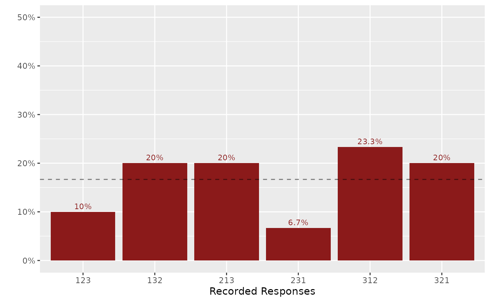
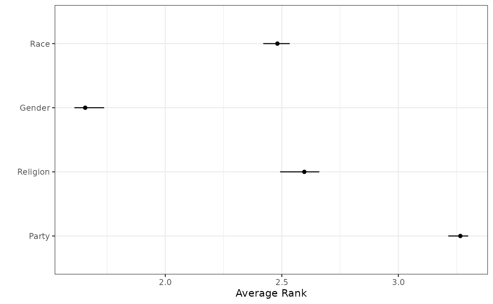

# 4. Visualizing Rankings

The following code chunk shows how to plot the distribution of ranking
profiles. This can help eyeball whether the ranking data is uniformly
distributed, which can of course be formally tested.

``` r
library(combinat)
#> 
#> Attaching package: 'combinat'
#> The following object is masked from 'package:utils':
#> 
#>     combn
library(rankingQ)

set.seed(100)
tab <- lapply(permn(seq(3)), paste0, collapse = "") |>
  sample(30, replace = TRUE) |>
  unlist() |>
  table() |>
  table_to_tibble()
plot_dist_ranking(tab, ylim = 0.5)
```



## Visualizing Average Ranks

The `plot_avg_ranking` function creates a visualization of average ranks
with confidence intervals:

``` r
data(identity)

# First compute bias-corrected estimates
out_direct <- imprr_direct(
  data = identity,
  J = 4,
  main_q = "app_identity",
  anc_correct = "anc_correct_identity",
  n_bootstrap = 10
)
#> No weight column supplied; using equal weights for all observations.

# Plot average ranks
library(dplyr)
#> 
#> Attaching package: 'dplyr'
#> The following objects are masked from 'package:stats':
#> 
#>     filter, lag
#> The following objects are masked from 'package:base':
#> 
#>     intersect, setdiff, setequal, union
out_direct$results |>
  filter(qoi == "average rank") |>
  mutate(
    item = factor(
      item,
      levels = paste0("app_identity_", seq(4)),
      labels = c("Party", "Religion", "Gender", "Race")
    )
  ) |>
  plot_avg_ranking()
```


