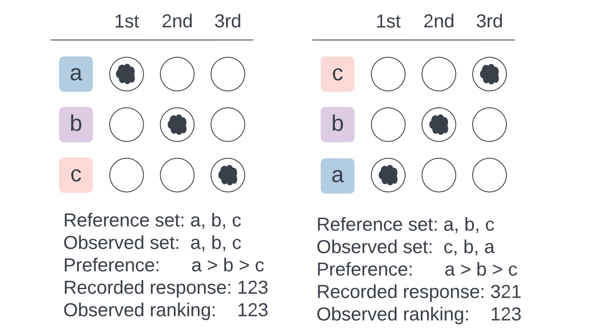
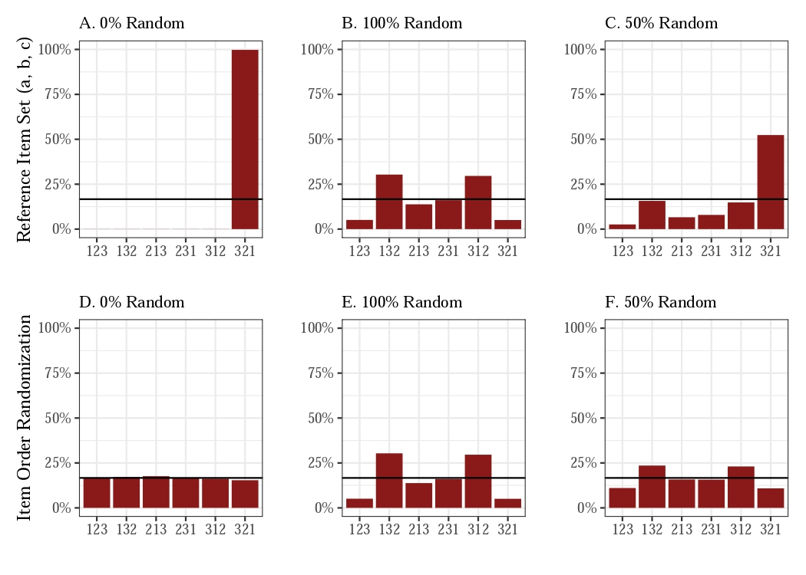

```{r, include = FALSE}
knitr::opts_chunk$set(
  collapse = TRUE,
  comment = "#>"
)
```

In this vignette, we show how to detect the presence of random responses using the **uniformity test**. This test is based on the idea that given respondent-level item order randomization, recorded responses will follow a uniform distribution in the absence of random responses. The uniformity test can be easily implemented even when researchers do not have any anchor ranking questions.

```{r setup, message=FALSE, warning=FALSE}
library(rankingQ)
data(identity)
```

## Recorded Responses

In an earlier vignette, we showed how to perform bias correction on ranking questions using the anchor question. But how do we know if there is a need for bias correction in the first place?

The distribution of rankings of *recorded responses* can show whether there are indeed random responses. Before we demonstrate this, first, we must clarify: what are recorded responses? The following figure shows the difference between *observed ranking* and *recorded response*, given item order randomization.



Suppose that we prefer items a-b-c in that order. And in the ranking exercise, they were presented in the order of a-b-c. Then, given the ordered reference set a-b-c, my observed ranking and recorded response are both 1-2-3. Recorded responses are identical to observed rankings when item orders are fixed. However, when an item order is not fixed, the observed choice set differs across respondents.

If, for example, the items were presented in the order of c-b-a, then our observed ranking is 1-2-3, while our recorded response is 3-2-1. This is because the *observed ranking* is the ranking of the items in the order of the reference set, regardless of the order in which they were presented. On the other hand, the *recorded response* is the ranking of the items in the order in which they were presented.

## Recovering Recorded Responses

The function `recover_recorded_responses` recovers the recorded responses from the observed rankings and the item order randomization. The function takes the `true_order`, `presented_order`, and `df` for data frame as arguments.

For example, in `identity`, the `app_identity` column contains the observed rankings, and the `app_identity_row_rnd` column contains the how the items were presented via item order randomization. Thus the presented order is `app_identity_row_rnd` and the true order is `app_identity`. 

For the first respondent, with the reference choice set of {party, religion, gender, race}, this respondent ranked party-gender-race-religion (1-4-2-3, i.e., party is first place, religion is fourth place, gender is second place, and race is third place). However, the items were presented to the respondent in the order of religion-party-race-gender (2-1-4-3). Thus, the recorded response is 4-1-3-2 (first option shown was religion, thus fourth place, second option shown was party, thus first place, the third option shown was race, thus third place, and the fourth and last option shown was gender, thus second place). It's a bit tricky at first, so please read this explanation carefully!

```{r}
recover_recorded_responses(
  presented_order = "app_identity_row_rnd",
  true_order = "app_identity",
  df = head(identity[, c("app_identity", "app_identity_row_rnd")], 10)
)

## Alternatively, for the first respondent
recover_recorded_responses(
  presented_order = "2143",
  true_order = "1423",
)
```

## Uniformity Test

### Theory

In [Atsusaka and Kim (2024)](https://osf.io/3ys8x), we prove that once there is item order randomization, the recorded responses will follow a uniform distribution in the absence of random responses. Suppose, for example, that everyone prefers a-b-c in that order. Some respondents will have a recorded response of 1-2-3, while others will have 3-2-1, given the differently observed sets of items. Then, in the absence of random responses, the proportion of recorded responses for each possible ranking should converge to 1/24 = 0.0417, given that there are 4! = 24 possible ways to rank the items. Accordingly, a notable deviation from the uniform distribution provides evidence for the presence of random responses.

What happens with random responses? The figure below shows some likely scenarios.



In this hypothetical world, suppose everyone prefers items in the order of c-b-a. With a reference item set of (a, b, c), the recorded responses will always be 3-2-1 (panel A). If item order is randomized, recorded responses will be uniformly distributed (panel D).

Now suppose that random responses occur in patterns such as panels B and E. If 50% of responses are random, recorded responses will be like panel C if the reference set is fixed for all respondents, or like panel F if the reference set is randomized.

### Test

The uniformity test checks whether the recorded responses follow a uniform distribution. Non-uniformity in the test suggests the presence of random responses.

```{r}
tab <- table(identity$app_identity_recorded)
chisq.test(tab, p = rep(1 / length(tab), length(tab)))
```

The results indicate that the recorded responses are not uniformly distributed, suggesting random responses in the main identity ranking question. The uniformity test was also applied to detect ballot order effects in ranked-choice voting (e.g., [Atsusaka (2024)](https://doi.org/10.1017/pan.2024.9)).

## Validity of the Anchor Question

Checking for uniformity also validates the usage of the anchor question. Although the assumption in the paper is simply that the proportion of random responses is the same in the main and the anchor question, the more implicit assumption is that those who are answering the anchor question correctly are not providing random responses to the anchor question.

We can check this by comparing the recorded responses of those who answered the anchor question correctly and incorrectly.

```{r}
## Correctly answered the anchor question
tab <- table(identity$anc_identity_recorded[identity$anc_correct_identity == 1])
round(prop.table(tab) * 100, digits = 1)
chisq.test(tab, p = rep(1 / length(tab), length(tab)))

## Incorrectly answered the anchor question
tab <- table(identity$anc_identity_recorded[identity$anc_correct_identity == 0])
round(prop.table(tab) * 100, digits = 1)
chisq.test(tab, p = rep(1 / length(tab), length(tab)))
```

As can be seen, while there is insufficient evidence to reject the null hypothesis for those who answered the anchor question correctly, the recorded responses of those who answered the anchor question incorrectly offer clear evidence for non-uniformity, where about 20% of respondents submitted either 1234 or 4321.
